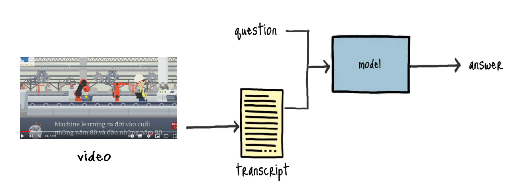
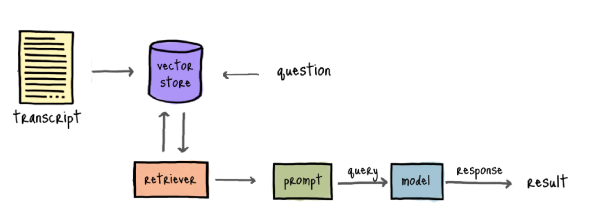
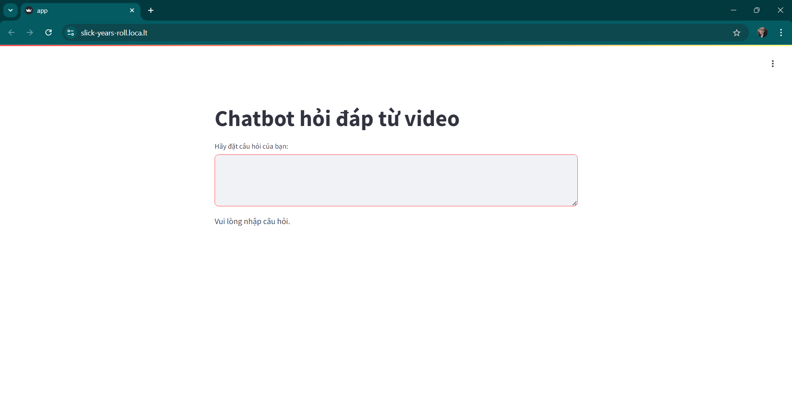
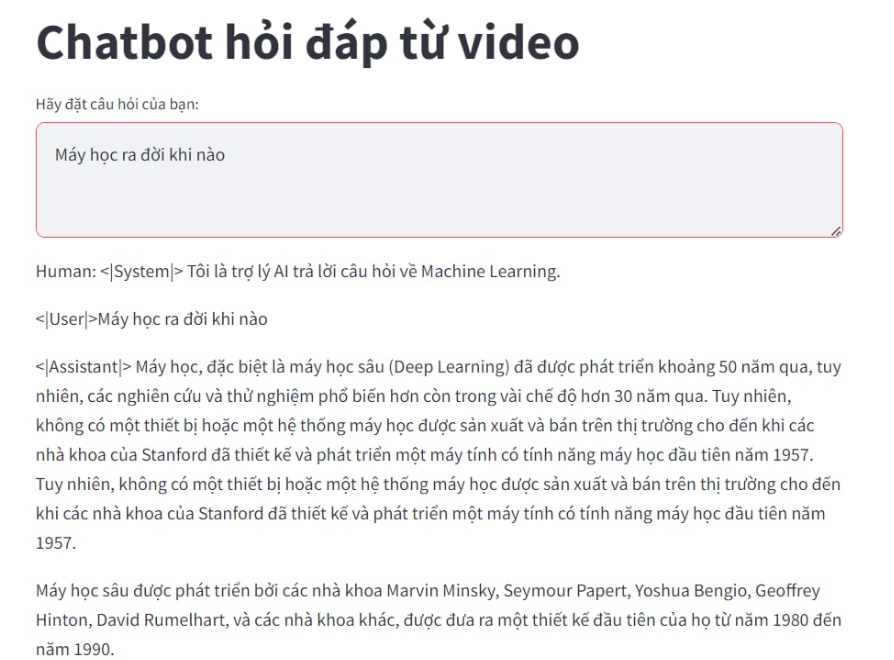

# Development of a Chatbot Q&A based on Video Content  

## Overview


The system utilizes the Whisper model to convert audio from videos into text. Afterward, the text data is processed and trained using the RAG (Retrieval-Augmented Generation) model via Huggingface's API. Users will interact with the Q&A system through a Streamlit interface, allowing them to ask questions based on the content of uploaded videos or YouTube videos.

### Pipeline 


### How to run?

Clone the project
```
$ git clone https://github.com/Baont99/Chatbot_QA_RAG_BNT.git
```

Install the requirements
```
$ pip install -r requirements.txt
```
Retrieves your external IP address using the wget command.
```
!wget -q -O - ipv4.icanhazip.com
```

Write source code into the app.py file and run: %%writefile app.py
Run
```
streamlit run app.py & npx localtunnel --port 8501
'''

[Or run in the Colab](https://colab.research.google.com/drive/1a8b2N4hh8SHkpfTVFf1E1_3uNXztnA1J#scrollTo=PPQnNWkIumIr)

### Result


